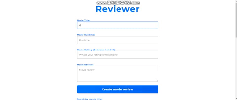

# Reviewer 

 

[View the live demo](https://reviewer-jp.herokuapp.com/)

If you'd like to view my portfolio, [Click here](https://jasonpallone.com)

# Description

This is a movie review app, it has full CRUD operations. The user can create a movie review, read/retrieve movie reviews, update movie reviews and delete them.
It is created using vanilla JavaScript on the front end with HTML and custom hand written CSS. For the back end it uses node.js, express, SQL and Sequelize. This app
is fully responsive for all devices.

